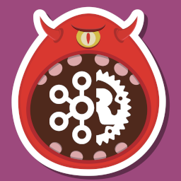

# Monstka - RUST version



This simple repository demonstrates how to consumes and produces messages with Kafka in RUST.


### Try it out

You should have `cargo`, `rust` and `docker` installed on your laptop to launch this project.
Launch the following commands to try it out.

```bash
# Install dependencies
cargo install

# Launch a Kafka container 
docker compose up -d

# Build the project and launch the build
cargo build
cargo run

```

You can send message to the desired topic thanks to the [JavaScript version of this repository](https://github.com/GridexX/DO-Monstka).

### Author 

Written by [@GridexX](https://github.com/GridexX) during a sunny day 😶 of May !